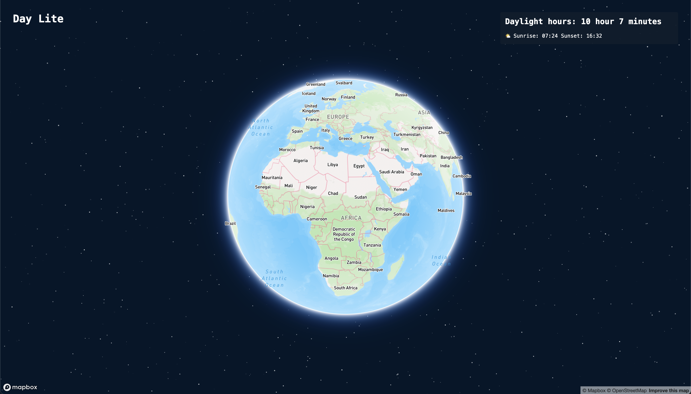

# Day Lite

[Live site](https://...)

## Details

### Time Frame

1 day

### Technologies

- React
- Vite
- Typescript
- Mapbox
- Astronomy Engine (npm package)

### App Overview

#### Development Process

This app is a purely front-end application which utilises two packages: `astronomy-engine` & `mapbox` to create an interactive globe which calculates the daylight hours of a specific location determined by cursor location on the map. I also used `dayjs` to work out differences between sunrise and sunset time and to format UTC time.



##### Noteworthy Items

To calculate a rough approximate for the UTC offset based on longitude I created a simple function. UTC offset can be loosely calculated by dividing the longitude by 15. This is because the Earth is divided into 24 time zones, each approximately 15 degrees of longitude apart.

```JS
function calculateUtcOffset(longitude: number) {
  const offset = Math.round(longitude / 15);

  return Math.max(-12, Math.min(14, offset));
}
```

#### Functionality

The app has a streamlined UX, relying on the map functionality to be intuitive. The user can freely rotate the globe and to find information about a desired location the cursor is used.


### Challenges & Achievements

Calculating the UTC offset with longitude to convert UTC time to local time

## Future Enhancements

- Ability to change the date to retrieve data for.
- Dynamically change the mapbox globe colour style dependant on active location current local time.
